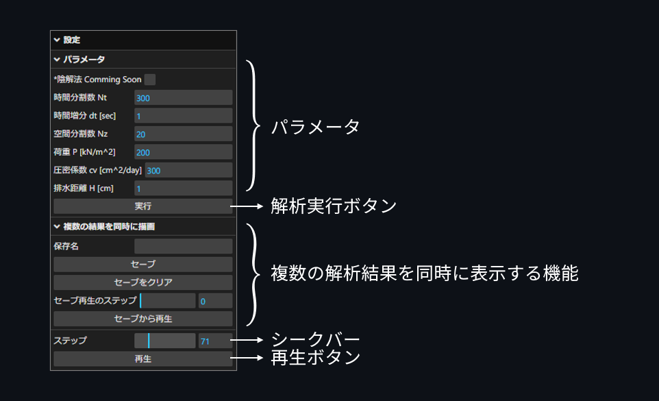

# 計算地盤課題

### コードを実行する手順
1. [node jsをインストール](https://nodejs.org/en/)
2. このプログラムをダウンロード
3. 展開したフォルダでコマンドを開き`npm install`
4. `npm run start`

### GUIの説明

### 用いたライブラリ・フレームワーク
* [Node.js](https://nodejs.org/en/)
* [electron](https://www.npmjs.com/package/electron)
* [lil-gui](https://www.npmjs.com/package/lil-gui)
* [plotly](https://github.com/plotly/plotly.js#readme)